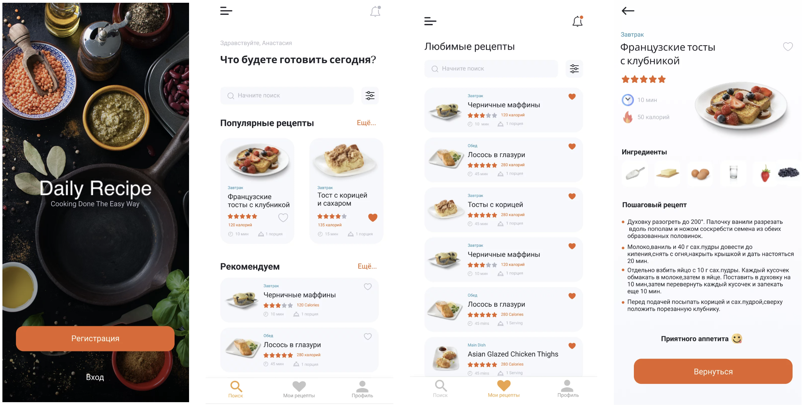

# Стартовый проект для интенсива "Основы Android-разработки. Быстрый старт"
Это стартовый проект, который будет дорабатываться на протяжении [интенсива для middle-разработчиков](http://intensive.androidschool.ru/basics/?utm_source=github&utm_medium=readme&utm_campaign=description)

В результате прохождения интенсива будет выполнен проект для поиска рецептов:

## Обучающий курс📚:
[Записаться на курс по ссылке](http://intensive.androidschool.ru/basics/?utm_source=github&utm_medium=readme&utm_campaign=description)
Подписывайтесь на наш [телеграм-канал](https://t.me/android_school_ru)
